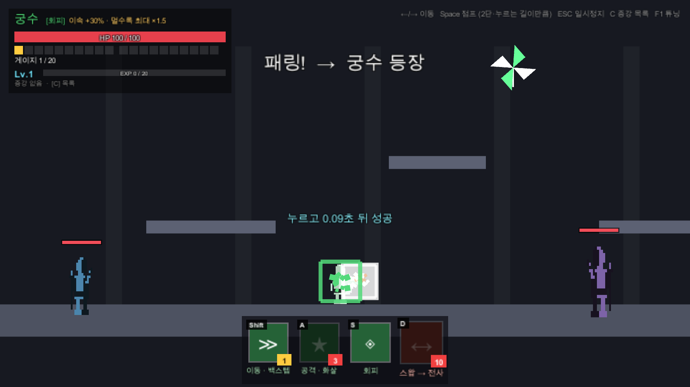
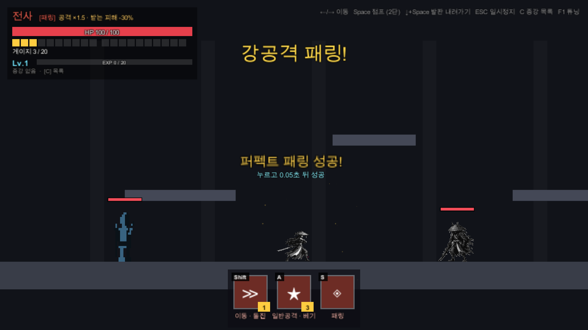
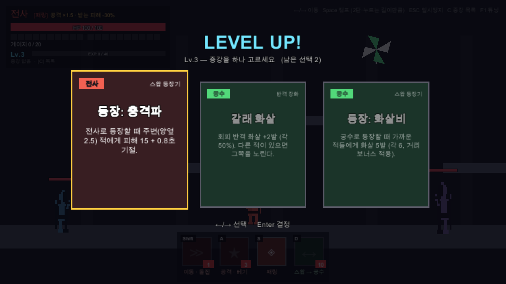

# 패링 로그라이크 (가제)

> **적의 공격을 타이밍 맞춰 막아내는 것(패링)이 모든 공격과 성장의 출발점인, 패링 액션 로그라이크.**

2인 팀 졸업 프로젝트 · Unity 6 · 2D 횡스크롤

현재 **화이트박스 프로토타입** 단계다. 그림 없이 네모로만 만들어 규칙과 손맛을 먼저 검증하고, 에셋은 그다음에 입힌다.



## 핵심 차별점

- **모든 딜은 방어에서 나온다**: 반격은 물론 공격·이동 스킬도 방어 성공으로만 차는 게이지를 써야 한다. 승부는 스킬 조합이 아니라 적 패턴을 얼마나 정확히 읽느냐에서 갈린다.
- **막으면 곧바로 반격한다**: 패링에 성공하면 그 자리에서 근접 반격(사거리 1.8)이 나가고, 입력 직후 0.08초 안에 막으면 "퍼펙트 패링" 연출이 붙는다.
- **Q로 무기를 바꾼다**: 근접(칼) ↔ 원거리(화살). 일반공격(A)과 패링 반격이 무기에 따라 달라지고 스킬창도 같이 바뀐다. 대시는 그대로. (궁수와 교대 시스템은 2026-10-08에 폐기했다.)
- **보이는 네모 = 판정 범위**: 눈에 보이는 박스와 실제 판정이 1:1로 같다.

| | ⚔️ 근접 | 🏹 원거리 |
|---|---|---|
| 일반공격 (A) | 베기 (15, 쿨 0.35초) | 화살 (12, 쿨 0.45초) |
| 패링 반격 | 근접 박스 (사거리 1.8, ×1.5) | 목표를 따라가는 화살 |
| 공통 | 패링(S) · 대시(Shift) · 받는 피해 -30% | 〃 |



## 지금 되는 것

- 패링 판정 (누른 뒤 0.3초), 헛스윙 페널티, 퍼펙트 패링, 강공격 반격
- 공용 게이지 20칸: 이동 스킬(1칸, 무적). 일반공격(A)은 게이지 없이 쿨타임 0.35초
- 경험치 → 레벨업 → 증강 3택 (증강 6종: 공용 3 · 플레이어 3)
- 몬스터 2종: 근접(예비 모션 뒤 베기) · 원거리(투사체), F1 패널에서 마릿수 조절
- 개발 도구: F1 튜닝 패널(타격감·판정·적 수치 실시간 조정), 연습 스위치, 자동 테스트 83개 (PlayMode)



## 조작

| 키 | 동작 |
|---|---|
| ← / → | 이동 |
| Space | 점프 (2단, 고정 높이) · ↓+Space 얇은 발판 내려가기 |
| S | 방어 (패링) |
| A | 일반공격 (무기에 따라 베기/화살) |
| Q | 무기 전환 (근접 ↔ 원거리, 쿨 0.5초) |
| Shift | 이동 스킬 (돌진) |
| C | 증강 목록 |
| F1 | 튜닝 패널 |
| ESC | 일시정지 |

## 실행

1. **Unity 6000.6.0f1**로 이 폴더를 연다.
2. 메뉴 **Tools → ParryRL → 프로토타입 씬 생성** → `Assets/Scenes/Prototype.unity`를 열고 플레이.

테스트(씬 생성 + PlayMode 테스트 + 화면 캡처):

```powershell
powershell -ExecutionPolicy Bypass -File Tools\run_tests.ps1
```

## 문서

- [`기획서.md`](기획서.md): 게임 규칙·수치의 기준 문서
- [`CLAUDE.md`](CLAUDE.md): 개발 규칙과 진행 상황
