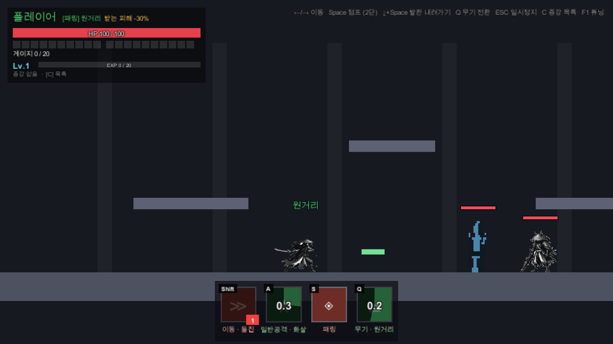
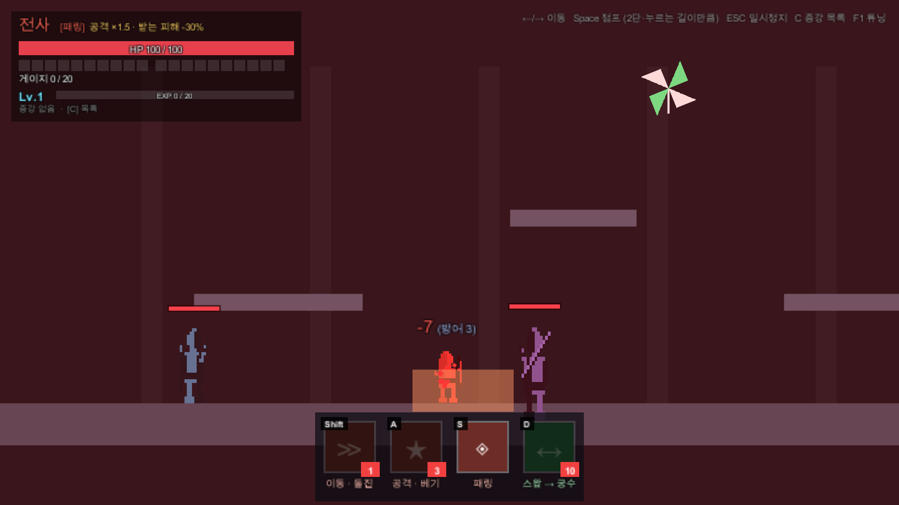

# 패링 로그라이크 (가제)

> **적의 공격을 타이밍 맞춰 막아내는(패링) 것이 모든 반격과 성장의 출발점인 2D 횡스크롤 액션 로그라이크.**
> 플레이어는 Q 하나로 근접(칼)과 원거리(화살)를 바꿔 들며 싸운다.

졸업 프로젝트 · Unity 6 (6000.6.0f1) · 2D · C#


---

## 한눈에 보기

| 항목 | 내용 |
|---|---|
| 장르 | 2D 횡스크롤 액션 · 로그라이크 (패링 중심) |
| 플레이어 | 한 명. **Q로 근접 ↔ 원거리 무기 전환**, 무기에 따라 일반공격·반격·스킬창이 바뀜 |
| 핵심 규칙 | 타이밍 맞춰 막으면(패링) 그 자리에서 반격이 나가고 게이지가 찬다 |
| 성장 | 경험치 → 레벨업 → 증강 3택 1 (증강 6종) |
| 적 | 근접(예비 모션 뒤 베기) · 원거리(투사체), 마릿수는 설정으로 조절 |
| 상태 | 프로토타입 — 규칙과 손맛 검증 중 (수치는 모두 가안) |

## 핵심 재미

- **막으면 곧 공격이다**: 패링에 성공하면 같은 자리에서 반격이 나간다. 입력 직후 0.08초 안에 막으면 **퍼펙트 패링** 연출(히트스탑·화면 어둡게·줌·집중선)이 붙는다.
- **연속 패링**: 한 번 막아도 판정 창이 끝까지 유지돼 같은 창 안에 겹쳐 오는 공격도 전부 막힌다. 막은 직후 다시 누르면 창이 새로 열린다. 앞뒤 **양방향** 모두 막는다.
- **무기 전환(Q)**: 쿨타임 0.5초, 게이지 소모 없음. 스킬창도 같이 바뀐다.
- **보이는 그림 = 판정 범위**: 캐릭터·몬스터·공격 이펙트의 그림은 판정 박스 위에 판정 크기에 맞춰 그려진다.
- **연습 도구가 내장**: F1 튜닝 패널로 판정·타격감·몬스터 수치를 게임 중 바로 바꾸고, 연습 스위치(무적·무한 게이지 등)로 한 가지씩 연습한다.

## 무기

| | ⚔️ 근접 | 🏹 원거리 |
|---|---|---|
| 일반공격 (A) | 베기 · 데미지 15 · 쿨 0.35초 · 몸이 칼을 따라 살짝 내딛음 | 직진 화살 · 데미지 12 · 쿨 0.45초 |
| 패링 반격 | 근접 박스 (사거리 1.8, 공격력 ×1.5) | 목표를 따라가는 화살 (×1.0) |
| 스킬창 색 | 붉은색 | 초록색 |
| 공통 | 패링(S) · 대시(Shift, 무적) · 받는 피해 -30% · 연속/양방향 패링 | 〃 |



## 조작

| 키 | 동작 |
|---|---|
| ← / → | 이동 |
| Space | 점프 (2단, 누르는 시간과 무관한 고정 높이) |
| ↓ + Space | 얇은 발판 아래로 내려가기 (발판은 아래에서 위로는 통과) |
| S | 방어 (패링) — 막은 직후 다시 누르면 판정 창 갱신 |
| A | 일반공격 (무기에 따라 베기 / 화살) |
| Q | 무기 전환 (근접 ↔ 원거리) |
| Shift | 이동 스킬: 돌진 (대시 중 무적, 게이지 1칸) |
| C | 획득한 증강 목록 |
| F1 | 튜닝 패널 (판정·타격감·몬스터·연습 스위치) |
| ESC | 일시정지 |

## 게임 규칙 요약

- **패링**: 누른 뒤 0.3초 동안 판정 창이 열린다. 닿으면 공격이 부서지고 데미지 없음, 게이지 충전(일반 +1 / 강공격 +3), 즉시 반격. 아무것도 못 막고 창이 끝나면 헛스윙(쿨타임 1초). 막은 적이 있으면 헛스윙이 아니다.
- **퍼펙트 패링**: 입력 후 0.08초 안에 닿으면 연출만 강해진다(효과·게이지는 동일).
- **게이지**: 패링 성공으로만 찬다(최대 20칸). 이동 스킬(돌진)이 1칸을 쓴다. 일반공격은 게이지 없이 쿨타임만 있다.
- **몬스터**
  - 근접: 예비 모션(일반 0.65초 / 강공격 1.2초 — 곧 반응시간) 뒤 몸 앞에서 한 번에 벤다.
  - 원거리: 사정거리 안이면 그 자리에서 쏘고, 벗어나면 다가온다.
  - 피격 경직 0.15초. F1 몬스터 탭에서 종류별 마릿수 1~10 조절.
- **증강 6종** (레벨업마다 3택 1)
  - 공용: 넓은 판정(활성 +0.05초) · 연쇄 방어(3연속 성공마다 게이지 +2) · 강공격 사냥꾼(강공격 방어 게이지 +2)
  - 플레이어: 지척의 일격(바짝 붙은 적 반격 +50%) · 피의 패링(패링 시 체력 회복) · 돌진 베기(돌진이 지나간 적에게 피해)


## 아트 · 사운드

- 플레이어(칼 든 사무라이)와 근접 몬스터는 도트 **애니메이션**, 공격 이펙트(`Assets/Art/Fx`)는 붓 질감의 도트 그림이다. 원본 시트는 `ArtSource/`, 프레임 자르기는 `Tools/sprites/process_sheets.ps1`.
- 원거리 몬스터는 단순 도트 스프라이트 3장, 효과음은 합성음 + 패링 성공음 wav 2개다.
- 원거리 무기용 플레이어 그림은 아직 없어 칼 든 그림 그대로 쓰고, 스킬창·상태창의 색과 글자로 구분한다.
- 에셋을 공개 배포하기 전에 라이선스를 확인할 것.



## 실행

1. **Unity 6000.6.0f1**로 이 폴더를 연다.
2. 메뉴 **Tools → ParryRL → 프로토타입 씬 생성** (씬·프리팹·그림 에셋 묶음을 코드로 만든다. 씬은 생성물이라 직접 편집하지 않는다).
3. `Assets/Scenes/Prototype.unity`를 열고 Play.

### 테스트

PlayMode 테스트 약 90개(판정·게이지·증강·몬스터·튜닝·그림 연동·무기 전환)와 화면 캡처(`Captures/`)가 있다.

```powershell
# Windows (씬 생성 + 전체 테스트 + 캡처)
powershell -ExecutionPolicy Bypass -File Tools\run_tests.ps1
```

```bash
# macOS — 에디터를 닫은 상태에서 직접 실행
UNITY=/Applications/Unity/Hub/Editor/6000.6.0f1/Unity.app/Contents/MacOS/Unity
$UNITY -batchmode -nographics -quit -projectPath . -executeMethod ParryRL.EditorTools.PrototypeSceneBuilder.Build
$UNITY -batchmode -projectPath . -runTests -testPlatform PlayMode -testResults results.xml
```

에디터가 이 프로젝트를 열고 있으면 배치모드가 잠금으로 실패한다. 그땐 `Assets`·`Packages`·`ProjectSettings`를 다른 폴더에 복사해서 그 사본으로 돌린다.

## 폴더 구조

```
Assets/
├── Scripts/            # asmdef ParryRL (네임스페이스 ParryRL)
│   ├── Core/           # GameManager · GameTuning(튜닝·JSON) · CameraRig · Controls · GameEnums
│   ├── Player/         # PlayerMotor(이동·점프·대시·내딛기) · PlayerDefense(패링 판정) · PlayerCombat(무기·반격·스킬)
│   │                   # PlayerParty(체력·피격) · PlayerSprite/CharacterArt(도트 애니메이션) · SkillGauge
│   ├── Combat/         # DamageCalc · EnemyAttack · MeleeStrike · PlayerProjectile · HitFeel · SuccessEffects
│   │                   # Fx · FxClip/AttackFxArt(공격 이펙트 그림) · Sfx(합성음) · WorldBar
│   ├── Enemy/          # EnemyController · EnemySpawner · EnemySprite/EnemyArt · EnemyCorpse
│   ├── Progression/    # PlayerLevel · AugmentManager/Catalog · RunModifiers · Augments/(증강 1개 = 파일 1개)
│   ├── UI/             # Hud · SkillBar · AugmentChoiceUI · AugmentListPanel · TuningPanel(F1) · UiKit
│   └── Editor/         # PrototypeSceneBuilder (씬·프리팹·에셋 묶음 생성)
├── Tests/PlayMode/     # 판정·증강·몬스터·튜닝·그림·캡처 테스트
├── Art/                # Characters/ Enemies/ Fx/ (도트 프레임) · Square.png
├── Sprites/ Audio/     # 원거리 몬스터 스프라이트, 패링 성공음
└── Scenes/ Prefabs/    # 생성물
ArtSource/              # 그림 원본 시트
Tools/                  # run_tests.ps1 · sprites/(프레임 자르기)
Tuning/tuning.json      # F1 패널로 바꾼 수치 (팀 공유)
Captures/               # 테스트가 찍는 화면 캡처
```

## 개발 방식 메모

- 모든 판정은 **실제 콜라이더 겹침**이다 (거리 계산 판정 금지). 연출은 `unscaled time`이라 히트스탑 중에도 재생된다.
- 플레이어 딜 계산은 `DamageCalc` 한 곳(기본 × 캐릭터 배율 × (1 + 증강 보너스 합))에서만 한다.
- 플레이 감각 수치는 `GameTuning`(F1 패널)에, 증강은 `RunModifiers`("이번 판 보정" 층)에 둔다.
- 증강 추가 = `Progression/Augments/XxxAugment.cs` + `AugmentCatalog` 한 줄 + 테스트.

## 개발 이력 (주요 변경)

1. 별도 패링 프로토타입(연출·효과음·퍼펙트 방어)을 합침
2. 전투 개편: 일반공격 게이지 무료·쿨타임 조정, 원거리 몬스터 AI, 몬스터 수 설정, 얇은 발판·고정 높이 점프
3. 그림 적용: 플레이어·근접 몬스터 도트 애니메이션, 공격 이펙트, 베기 내딛기
4. **궁수·스왑·회피 시스템 폐기** — 플레이어 단독으로 정리, 증강 12종 → 6종
5. 패링 개선: 양방향·연속·겹침 패링, 근접 몬스터 예비 모션 연장
6. **무기 전환(Q)**: 근접 ↔ 원거리, 스킬창 연동

## 문서

- [`기획서.md`](기획서.md): 게임 규칙·수치 기준 문서 (⚠️ 궁수·스왑 폐기 전 내용이 본문에 남아 있다 — 맨 위 경고 참고)
- [`CLAUDE.md`](CLAUDE.md): 개발 규칙·진행 상황·결정 사항
