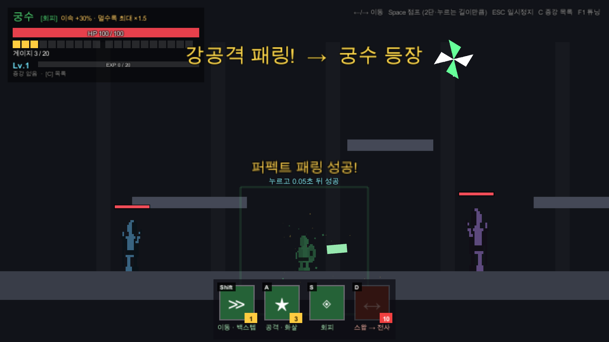

# 패링 로그라이크 (가제)

> **적의 공격을 타이밍 맞춰 막아내는 것(패링·회피)이 모든 공격과 성장의 출발점인, 전사·궁수 2인 교대 액션 로그라이크.**

2인 팀 졸업 프로젝트 · Unity 6 · 2D 횡스크롤

현재 **화이트박스 프로토타입** 단계다. 그림 없이 네모로만 만들어 규칙과 손맛을 먼저 검증하고, 에셋은 그다음에 입힌다.


## 핵심 차별점

- **모든 딜은 방어에서 나온다**: 반격은 물론 공격·이동 스킬도 방어 성공으로만 차는 게이지를 써야 한다. 승부는 스킬 조합이 아니라 적 패턴을 얼마나 정확히 읽느냐에서 갈린다.
- **강공격을 막으면 캐릭터가 교대된다**: 근접 전사(패링: 막는다) ↔ 원거리 궁수(회피: 스친다). 새로 등장한 캐릭터가 등장과 동시에 반격한다.
- **두 캐릭터, 한 체력**: 체력을 공유하고, 맞는 순간 누가 나와 있느냐에 따라 받는 피해가 달라진다.
- **보이는 네모 = 판정 범위**: 눈에 보이는 박스와 실제 판정이 1:1로 같다.

| | ⚔️ 전사 | 🏹 궁수 |
|---|---|---|
| 방어 | 패링: 공격을 막아 부순다 | 회피: 공격이 몸을 스쳐 지나간다 |
| 반격 | 근접 (사거리 1.8) | 화살 (멀수록 강해짐, 최대 ×1.5) |
| 패시브 | 공격 ×1.5 · 받는 피해 -30% | 이동 속도 +30% |



## 지금 되는 것

- 패링·회피 판정 (누른 뒤 0.3초), 헛스윙 페널티, 강공격 강제 교대 + 등장 반격
- 공용 게이지 20칸: 공격 스킬(3칸) · 이동 스킬(1칸, 무적) · 수동 교대(10칸)
- 경험치 → 레벨업 → 증강 3택 (증강 12종: 공용 4 · 전사 4 · 궁수 4)
- 몬스터 2종: 근접(예비 모션 뒤 베기) · 원거리(투사체)
- 개발 도구: F1 튜닝 패널(타격감·판정·적 수치 실시간 조정), 연습 스위치, 자동 테스트 83개


## 조작

| 키 | 동작 |
|---|---|
| ← / → | 이동 |
| Space | 점프 (2단, 누르는 길이만큼) |
| S | 방어 (전사 패링 / 궁수 회피) |
| A | 공격 스킬 |
| Shift | 이동 스킬 (전사 돌진 / 궁수 백스텝) |
| D | 수동 교대 |
| C | 증강 목록 |
| F1 | 튜닝 패널 |
| ESC | 일시정지 |

## 실행

1. **Unity 6000.6.0f1**로 이 폴더를 연다.
2. 메뉴 **Tools → ParryRL → 프로토타입 씬 생성** → `Assets/Scenes/Prototype.unity`를 열고 플레이.

테스트(씬 생성 + PlayMode 테스트 + 화면 캡처):

```powershell
powershell -ExecutionPolicy Bypass -File Tools\run_tests.ps1
```

## 문서

- [`기획서.md`](기획서.md): 게임 규칙·수치의 기준 문서
- [`CLAUDE.md`](CLAUDE.md): 개발 규칙과 진행 상황
